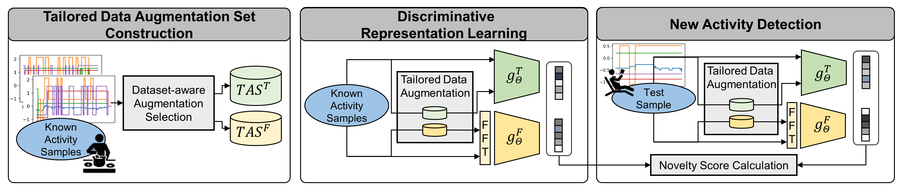

# 🧠🏃 CLAN: Self-supervised Dual-view Framework with Tailored Negative Sampling for New Activity Detection

CLAN is a **self-supervised dual-view framework** designed for robust **new activity detection** in human activity recognition (HAR) systems. It learns discriminative and invariant representations from **only known activity data**, without requiring access to any novel activity samples during training.

#### Figure: CLAN framework. It consists of tailored Data Augmentation Set Construction, Discriminative Representation Learning, and Novelty Detection stages.

## 🚀 Motivation

Most HAR systems assume a fixed set of known activities. However, in real-world scenarios, *new activity patterns*—unseen during training—frequently occur. Detecting such activities at inference time is challenging due to:

- Overlapping patterns between known and new activities  
- High intra-class variability within known activities  
- Heterogeneous sensor modalities and dataset domains  

## 🔧 Core Components

#### 1. Multi-view Decomposition
To reduce feature entanglement and capture complementary information, CLAN uses a **two-tower encoder**:
- **Time-domain encoder** captures local temporal structures
- **Frequency-domain encoder** captures periodic and spectral patterns

#### 2. Diverse Augmentation Repulsion Learning
To ensure robustness to intra-class variations, CLAN:
- Applies **multiple strong augmentations** to each known activity sample
- Treats the augmented views as **negatives** in contrastive learning  
→ Encourages learning of **transformation-invariant** representations

#### 3. Dataset-aware Augmentation Selection
To adapt to diverse sensor environments, CLAN:
- Trains a simple **binary classifier** to evaluate augmentation strength
- Automatically **selects effective augmentation strategies** per dataset

---

## 📊 Results

CLAN consistently outperforms state-of-the-art baselines on five real-world HAR benchmarks, achieving up to **+9.24% improvement in AUROC** for detecting new activities.

---

